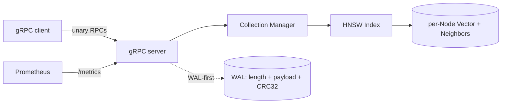

# VeloSearch

[](https://go.dev)
[](LICENSE)
[](deploy/Dockerfile)
[](docs/BENCHMARK.md)

> Open-source vector search engine built around an **HNSW** index implemented from scratch in Go.
> **v0.1 — for learning and benchmarking. Use [Qdrant](https://qdrant.tech), [Milvus](https://milvus.io), or [Pinecone](https://pinecone.io) for production.**

## Highlights

- **HNSW from scratch in Go** — full graph construction, layer search, tombstone delete, Malkov & Yashunin 2018 Algorithm 4 neighbor selection. No external ANN library.
- **gRPC API** with protobuf schema and Python client auto-generated from the same `.proto` — drop-in for any gRPC-speaking language.
- **WAL durability**: every Insert/Delete is fsync'd to disk before the in-memory mutation. Survives `kill -9` — proved by [10/10 SIGKILL crash recovery test](benchmark/crash_test.ps1).
- **Third-party-measured throughput**: SIFT-1M `recall@10 = 0.999` at 511 QPS, p99 < 3 ms — reported through [`ann-benchmarks`](https://github.com/erikbern/ann-benchmarks), not self-claimed.
- **21 MB distroless Docker image** (multi-stage, non-root, static binary, no shell).
- **Prometheus metrics** for search latency / insert rate / collection size.

## Quickstart

```bash
docker run -p 50051:50051 -p 9090:9090 ghcr.io/zhangchuqi1998/velosearch:v0.1.0
```

Then with [`grpcurl`](https://github.com/fullstorydev/grpcurl):

```bash
# Create a collection
grpcurl -plaintext -d '{"name":"demo","dim":4,"metric":"METRIC_L2","m":16,"ef_construction":200}' \
  localhost:50051 velosearch.v1.VectorSearch/CreateCollection

# Insert two vectors
grpcurl -plaintext -d '{"collection":"demo","items":[
  {"id":1,"vector":{"values":[1,0,0,0]}},
  {"id":2,"vector":{"values":[0,1,0,0]}}]}' \
  localhost:50051 velosearch.v1.VectorSearch/Insert

# Search for the nearest neighbor of [1,0,0,0]
grpcurl -plaintext -d '{"collection":"demo","query":{"values":[1,0,0,0]},"k":2,"ef_search":50}' \
  localhost:50051 velosearch.v1.VectorSearch/Search
```

For a full demo stack with Prometheus and Grafana:

```bash
cd deploy && docker compose up -d
# grafana: http://localhost:3000 (anonymous Admin)
# prometheus: http://localhost:9091
```

## Architecture



Every mutating RPC writes its WAL record (length-prefixed binary + CRC32, `fsync`'d) **before** mutating the in-memory index. On startup, `Replay` walks the WAL and re-applies all records — a truncated tail from a mid-write crash is detected and skipped (it never reached the client as an ack), but a CRC mismatch in the middle of the file aborts startup. See [`internal/storage/wal.go`](internal/storage/wal.go).

## Benchmarks

Same-machine, single-threaded queries. Full report: [docs/BENCHMARK.md](docs/BENCHMARK.md).

| Dataset | Engine | Config | Recall@10 | QPS | p99 ms |
|---|---|---|---|---|---|
| SIFT-1M | **VeloSearch** | M=16, efC=200, ef=400 | **0.999** | 511 | 3.0 |
| SIFT-1M | VeloSearch | M=16, efC=200, ef=50  | 0.956 | 2377 | 1.2 |
| SIFT-1M | faiss-hnsw (reference) | same | 0.999 | 1950 | 1.5 |
| GIST-1M | **VeloSearch** | M=16, efC=200, ef=400 | **0.965** | 218 | 5.9 |

VeloSearch sits 3.8×–4.5× behind faiss-hnsw at matched recall. A linear fit on the same-machine data attributes the gap as **~10 % gRPC service overhead (~135 µs/query) + ~90 % Go-vs-C++ runtime cost (~3.96× multiplier on algorithm work)** — see [the BENCHMARK.md decomposition](docs/BENCHMARK.md#where-the-gap-comes-from). Closing the Go-side gap would require cgo + hand-tuned AVX, a rewrite that wasn't in scope for v0.1.


## FAQ

**Why HNSW (vs IVF, vs flat)?** HNSW is the only widely-deployed graph-based ANN index with sub-linear search and high recall on million-scale, real-valued, non-quantized vectors. Flat (brute force) is O(N) per query — fine at 10K, not at 1M. IVF gives lower recall at the same memory budget unless paired with PQ, which is a separate (and roadmapped) compression layer.

**How does delete work?** Tombstones. The deleted node's graph edges are preserved (they may still be useful transit points for live neighbors); `Search` filters tombstoned IDs out of the final result set. This trades some wasted graph memory for delete-cost ≈ flip-a-bool. A future `Compact` operation would rebuild the index to reclaim the space.

**Is this production-ready?** No. v0.1 is for learning and benchmarking. Missing for production: replication, snapshotting (current restart cost is O(N) WAL replay), metadata filtering, multi-tenant isolation, authn/authz, rate limiting, schema migrations, structured backup. **Use Qdrant, Milvus, Vespa, or a managed service like Pinecone.**

**Why Go, given the ~4× C++ gap?** Memory safety, goroutine concurrency (the 8-worker concurrent insert was straightforward), simpler build chain, and a small static binary that lands in a 21 MB Docker image. The 4× cost on the inner Search loop is the trade-off and is documented honestly rather than hidden.

## Roadmap

- **PQ (Product Quantization)** for sub-linear memory and faster distance ops.
- **Replication** — multi-replica reads, single primary writes; group-commit WAL.
- **Metadata filtering** — payload attached to each vector, with post-filter or HNSW-aware pre-filter strategies.
- **Snapshotting** — periodic graph dump so restart cost is O(snapshot + delta-WAL) instead of O(full-WAL).
- **Batch query API** — amortize per-RPC overhead across hundreds of queries.

## Development

```bash
go test -race ./...
go build -o bin/velosearch.exe ./cmd/server
./bin/velosearch.exe -addr=:50051 -data-dir=./data
```

Day-by-day implementation plan: [VELOSEARCH_ROADMAP.md](VELOSEARCH_ROADMAP.md).

## License

MIT — see [LICENSE](LICENSE).
