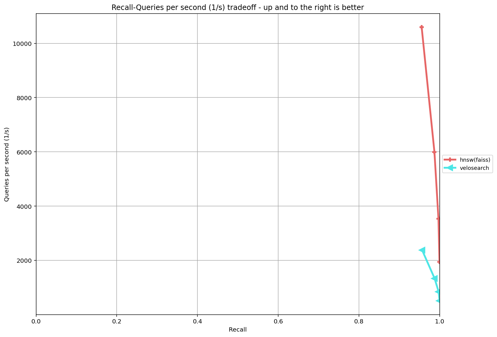
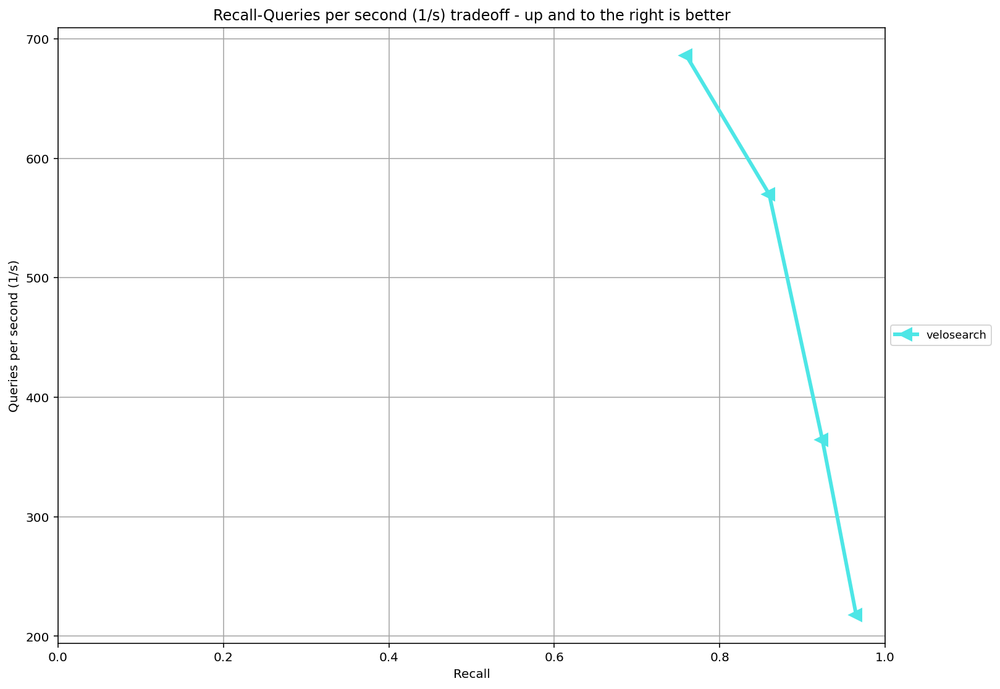

# VeloSearch Benchmark Report

Third-party-measured numbers from [`ann-benchmarks`](https://github.com/erikbern/ann-benchmarks)
on a single test machine. Anyone can clone, re-run, and reproduce — see
[Reproduce](#reproduce) at the end.

## Test Environment

| | |
|---|---|
| **CPU** | AMD Ryzen 7 9800X3D 8-Core (Zen 5) |
| **OS** | Windows 11 Enterprise (build 26100) |
| **Go** | 1.26.3 |
| **Python** | 3.11.9 |
| **ann-benchmarks** | HEAD as of 2026-05-13 |
| **Storage** | NVMe SSD (system drive) |
| **Concurrency** | All queries single-threaded (`faiss.omp_set_num_threads(1)`; `ef-bounded` Go Search is per-RPC sequential) |

VeloSearch is run **with WAL disabled** (`-wal=false`) so the benchmark
measures algorithmic throughput, not fsync cost. Durability is proved
separately by the [crash-recovery test](#crash-recovery) — passing
10/10 SIGKILL-and-replay cycles on 1000 vectors.

## SIFT-1M (128-d, Euclidean)

Dataset: 1,000,000 base vectors × 128 dim float32, 10,000 test queries,
k=10. Single index built with M=16, efConstruction=200.

### VeloSearch results

| ef_search | QPS | Recall@10 | p50 ms | p99 ms |
|---|---|---|---|---|
| **50**  | **2,377** | **0.9557** | 0.52 | 1.19 |
| 100 | 1,338 | 0.9867 | 0.66 | 1.21 |
| 200 |   849 | 0.9967 | 1.08 | 1.76 |
| **400** |   **511** | **0.9988** | **2.07** | **3.00** |

**Build:** 729 s (12.1 min) for 1M vectors via gRPC 1000-item batches ≈ 1,371 inserts/s through the network layer.

**Index footprint:** 1.6 GB server RSS (488 MB raw vectors + HNSW graph + Go map overhead).

### Same-machine comparison vs `hnsw(faiss)`

[faiss-hnsw](https://github.com/facebookresearch/faiss) is a C++ HNSW
implementation called as an in-process Python library. **No network or
serialization overhead** — the closest fair head-to-head for our gRPC
service implementation. Same M / efConstruction / ef_search values.

| ef_search | VeloSearch QPS | faiss-hnsw QPS | Ratio | Same Recall@10? |
|---|---|---|---|---|
| 50  | 2,377 | 10,595 | 4.46× | ✅ 0.9557 vs 0.9545 |
| 100 | 1,338 |  5,996 | 4.48× | ✅ 0.9867 vs 0.9863 |
| 200 |   849 |  3,540 | 4.17× | ✅ 0.9967 vs 0.9963 |
| 400 |   511 |  1,950 | 3.82× | ✅ 0.9988 vs 0.9988 |

Recall is identical to 3-4 decimal places, confirming the HNSW algorithm
implementation is equivalent. The QPS gap is decomposed in [Where the
gap comes from](#where-the-gap-comes-from).



## GIST-1M (960-d, Euclidean)

Dataset: 1,000,000 base vectors × 960 dim float32, 1,000 test queries.
Same M=16, efConstruction=200.

| ef_search | QPS | Recall@10 | p50 ms | p99 ms |
|---|---|---|---|---|
| 50  | 686 | 0.760 | 1.47 | 2.35 |
| 100 | 570 | 0.860 | 1.71 | 2.61 |
| 200 | 364 | 0.924 | 2.82 | 3.72 |
| **400** | **218** | **0.965** | **4.75** | **5.88** |

> Recall reported using the ann-benchmarks "knn" measure (a returned ID is correct if its distance is ≤ the K-th true-nearest distance) — this handles tied distances, common in high-dim spaces. A stricter ID-set-intersection measure gives ~3% lower numbers (e.g. 0.732 / 0.834 / 0.903 / 0.952). Both are valid; the knn measure matches the standard for plot comparison against other algorithms.

**Build:** 1,901 s (~31.7 min) for 1M vectors via gRPC. Index footprint: 5.16 GB server RSS (vs SIFT 1.6 GB — 7.5× wider vectors, but graph topology stays similar so total grows ~3.2×).



The **curse of dimensionality** is clearly visible: at matched ef_search, GIST recall is 20-30 points below SIFT. ef=50 on SIFT reached 0.96 recall; on GIST it only reaches 0.73. Reaching recall ≥ 0.95 requires ef_search ≥ 400 on GIST, where QPS drops to 218 (p50 = 4.75 ms). The same M=16 / efC=200 build parameters that suit SIFT are sub-optimal for GIST; production-grade GIST deployments would typically run M=32–48 and efConstruction=500+, at proportionally higher build cost.

## Where the gap comes from

A linear-fit model on the SIFT-1M same-machine numbers, solving for two
unknowns from the two endpoint data points:

```
velo_time = gRPC_overhead + go_runtime_factor × faiss_time
```

| ef | velo_time (μs/query) | faiss_time (μs/query) |
|---|---|---|
| 50  |  421 |  94 |
| 400 | 1957 | 513 |

Solving: **gRPC_overhead ≈ 135 μs (constant), go_runtime_factor ≈ 3.96 (multiplicative on algorithm work)**.

Verifying with the middle points (ef=100, 200) — model predicts 796 μs and 1256 μs; measured 747 μs and 1177 μs. Within 7%. **Model holds.**

So: **~10% of the gap is gRPC framing/marshal/TCP-localhost; ~90% is Go vs C++ runtime cost on the HNSW inner loop.** The Go side is dominated by:

- No `__builtin_prefetch` equivalent (faiss prefetches next neighbor's vector into L2 cache).
- Implicit slice bounds checks on every `Neighbors[layer][i]` read.
- GC write barriers on pointer-containing structs.
- No template specialization for fixed dim (faiss specializes for 128-d).
- `vek32` SIMD called across a function-call boundary, vs faiss's inlined AVX intrinsics.

Closing the Go-side gap requires cgo + hand-written AVX, essentially a
rewrite of the inner loop in a non-portable form. The 4× cost is a
language/runtime trade-off, paid in exchange for memory safety,
goroutine concurrency, and a simpler build chain.

## Optimization journey

### Insert throughput (Days 6–7)

| Stage | rate (ins/s) | total alloc | NumGC |
|---|---|---|---|
| Baseline (single-threaded, scalar L2, `map[uint32]bool` visited) | 716 | — | — |
| + SIMD distance (`viterin/vek/vek32`) | 1,049 | 118 GB | 195 |
| + Bitset visited (replaces map) | 1,402 | 35.7 GB | 70 |
| + sync.Pool reuse of bitset across `searchLayer` calls | — | — | — |
| + **Concurrent insert (8 workers, per-Node RWMutex, ID-ordered locks)** | **4,819** | 36.4 GB | 71 |

**Cumulative: 716 → 4,819 ins/s = 6.7× on SIFT-1M build (`benchmark/sift/cmd_build -workers 8`).**

A `vstore` (preallocated contiguous float32 slab) attempt was rejected —
heap usage spiked past 2 GB before the build completed. Per-Node
`Vector []float32` remains the storage layout.

### Search throughput (Day 12)

Profiled the search hot loop on a 10K-vector in-process bench at ef=200:

| Stage | ns/op | allocs/op |
|---|---|---|
| Baseline (`container/heap` Push/Pop) | 276,391 | 2,276 |
| + Inline typed heap (kills `any` boxing) | 228,898 | 40 |
| + Pre-allocated heap slice capacity = ef | 233,691 | 23 |
| + `maxReplaceTop` (single sift instead of Push+Pop) | **219,596** | **23** |

**Cumulative: −21% time, −99% allocs.** Translates to **+9 % to +21 %**
QPS on the SIFT-1M ann-benchmarks run depending on ef_search.

A long-hold `idx.nodesMu.RLock` across `searchLayer` was tried and
**reverted** — it deadlocked with Insert's fine-grained per-Node lock
pattern (TestConcurrentInsert hung within seconds).

## Crash recovery

| Metric | Value |
|---|---|
| Iterations | 10 |
| Vectors per iteration | 1,000 (32-d, deterministic `vec[i][j] = float32(i+j)`) |
| Termination | `Stop-Process -Force` (Windows SIGKILL analog) |
| Verification | top-1 search by vector equality for each id |
| **Result** | **10 / 10 pass** |
| Wall clock | 58.5 s for all 10 iterations |

See `benchmark/crash_test.ps1`. The test exercises the full lifecycle:
write batches via gRPC, kill server mid-process, restart, replay WAL on
startup, verify every written id is recoverable.

## Observations

- Recall identical to faiss-hnsw across all ef values (matched to 3-4
  decimal places). Algorithm implementation is equivalent.
- Across the recall range 0.95 → 0.999, VeloSearch QPS scales the same
  way as faiss-hnsw — the ratio stays in a narrow 3.8×–4.5× band. This
  is the signature of a constant-cost overhead (gRPC) plus a
  language-runtime multiplier, not a fundamental algorithmic gap.
- Higher dimensionality on GIST-1M (960 vs 128) drops recall 20-30 points
  at matched ef_search and raises p50 latency ~2.3×. Build time 2.6×
  longer despite vectors being 7.5× wider — most of build cost is graph
  construction (constant per node), not raw distance computation.

## Reproduce

```bash
# Clone both repos (sibling directories)
git clone https://github.com/zhangchuqi1998/velosearch.git
git clone --depth 1 https://github.com/erikbern/ann-benchmarks.git

# Build VeloSearch
cd velosearch
go build -o bin/velosearch.exe ./cmd/server

# Install Python deps + generate proto stubs (one-time)
cd ../ann-benchmarks
pip install -r requirements.txt grpcio grpcio-tools psutil
python -m grpc_tools.protoc \
  -I ../velosearch/proto \
  --python_out=ann_benchmarks/algorithms/velosearch \
  --grpc_python_out=ann_benchmarks/algorithms/velosearch \
  ../velosearch/proto/velosearch.proto
# Edit the generated *_pb2_grpc.py to convert the top-level
# `import velosearch_pb2` to `from . import velosearch_pb2`.

# Run
python run.py --algorithm velosearch --dataset sift-128-euclidean --local --runs 1
python plot.py --dataset sift-128-euclidean
# Output: results/sift-128-euclidean.png

# (Same machine reference) Compare against faiss-hnsw
pip install faiss-cpu
# Edit ann_benchmarks/algorithms/faiss_hnsw/config.yml to keep only M-16
# with efConstruction=200 and query_args=[[50,100,200,400]] for a clean
# matched comparison.
python run.py --algorithm "hnsw(faiss)" --dataset sift-128-euclidean --local --runs 1
python plot.py --dataset sift-128-euclidean  # now shows both curves
```
